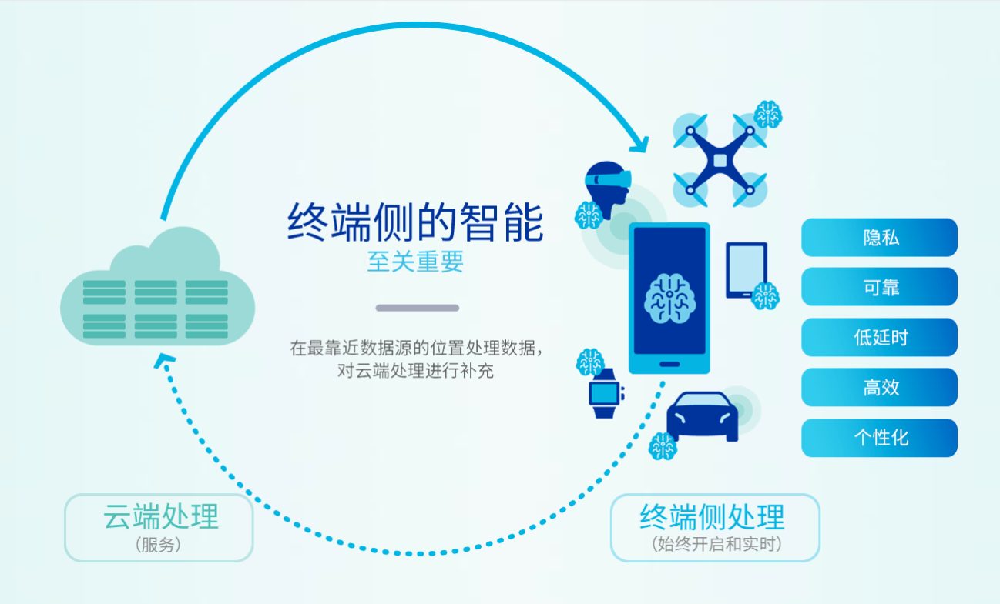

# FrontEnd+

## 端侧AI（On-device AI)

端：物联网中的任何终端
AI+IoT=AIoT

### 端侧AI的优势

1.隐私:数据存储本地无需上传
2.可靠:降低数据上传云端链路过长导致的错误率
3.低延时:本地存储计算
4.成本|高效:减少不必要流量,选择性占用网络宽带资源
5.个性化:持续学习,模型调整,隐私保护的分布式学习.带来个性化的互动与体验.

### 端侧AI的难点

1.硬件资源限制
存储、内存、计算资源
2.模型的版本管理、生命周期
3.终端的种类很多，不同硬件架构的适配和模型迁移成本过高
4.3同时导致了端侧AI应用复杂度增加

### 目前普遍？？todo：想个标题

终端侧处理+云端处理补充:协同合作（云端协同）

### 示例
### 微信
小程序+AI

### 阿里

### 参考：
https://www.qualcomm.cn/on-device-ai/details
https://zhuanlan.zhihu.com/p/129876992

## web应用
### 前端机器学习
#### Tensorflow.js

#### 阿里PipCook

#### 参考：
https://mp.weixin.qq.com/s/WYmhBBb1x2cbdFSweNooNQ

### 生成前端代码
？用代码生成代码，为何不用前一个代码得到最后的需求？？
等待一个新的语言或框架，省掉样板代码。

