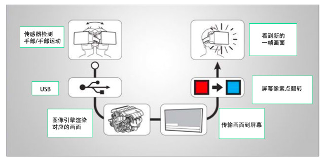

## VR vs AR

### 概念

#### 维基百科
VR

虚拟现实（Virtual Reality）可以称为沉浸式多媒体或计算机模拟现实。此项技术能复制出一个环境，以模拟出物理存在于某个真实世界或想象世界中的感受，并且还允许用户与这个复制出的世界进行交互。

AR

增强现实（Augmented Reality）是一种实时的、直接或间接的物理现实环境视图，其中包含了由计算机生成的（声音、视频、图形或GPS数据）传感器输入而进行的内容增强（或补充）元素。

MR

混合现实（Mixed reality） - 有时被称为hybrid reality – 真实和虚拟世界相融合，并生成新环境和可视化表现，其中物理世界和数字对象能实时共存和互动。

#### 简单来说
VR 是纯虚拟场景，AR 是基于现实场景建立虚拟场景，把虚拟世界叠加到现实世界中，MR 跟AR之间的界限很模糊，一般说来跟AR的区别在于，AR是虚拟场景和现实场景叠加，MR 是将现实场景数字化，再加以‘增强’，然后再呈现给用户。
比如看到一个封闭的电器产品，显示出整个电器的内部构造，就像可以看穿这个‘黑盒子’一样。
也可以这么说，AR中的虚拟场景虽然是建立在现实环境中，但是不处理现实场景中的事物，而MR是要对现实场景中的事物数字化然后进行处理再显示。

VR的特点是：
+ 沉浸感：意即身临其境，难辨真假。由以下两点保证这样的体验感。
+ 多感知性：意即除了视觉感知之外，还有听觉、力学、触觉、运动甚至味觉感知。理想的虚拟现实技术应该具有一切人类在真实世界所具有的感知功能。
+ 交互性：指用户对模拟环境内物体的可操作程度和从环境得到反馈的自然程度

AR的特点
+ 真实世界与虚拟世纪的信息集成
+ 实时交互性
+ 在三维尺度空间中增添定位虚拟物体

总结下来，
VR需要解决的核心问题是图形计算和沉浸感（即感知和交互）。
AR需要解决的核心问题是图像识别和跟踪，以及交互。
MR需要解决的核心问题是对现实世界的3D扫描，以及远近空间的感知等。

#### 交互和设备
个人理解，AR和VR都需要处理交互，并且交互的触发场景可以想通，但是处理方式不同，毕竟一个是处理虚拟场景，另一个是虚拟+现实场景。

VR设备：

因为VR是纯虚拟场景，所以VR装备更多的是用于用户与虚拟场景的互动交互，更多的使用是：位置跟踪器、数据手套（5DT之类的）、动捕系统、数据头盔等等。

AR设备：

由于AR是现实场景和虚拟场景的结合，所以基本都需要摄像头，在摄像头拍摄的画面基础上，结合虚拟画面进行展示和互动，比如GOOGLE GLASS这些（其实严格的来说，IPAD，手机这些带摄像头的只能产品，都可以用于AR，只要安装AR的软件就可以。）

### 技术简介（WEB）

#### 支持浏览器

#### WebXR

XR意即无论什么R，包括VR|AR却不仅限于此。

以下是W3C Immersive Web社区定义的一套WebXR设备的API规范。

其中设备包括

| | Headset Devices | Handheld Device e.g. Phone |
|:--|:------------|:------------|
| VR | VR Devices, previously handled by WebVR | Magic Window Behaviour |
| AR | Mixed Reality Headsets  | Phone AR |

> https://immersive-web.github.io/webxr/

对应的openxr
> https://www.khronos.org/openxr

谷歌WebVR入门指南，包括polyfill
> https://developers.google.com/web/fundamentals/vr/getting-started-with-webvr/

React VR
> https://facebook.github.io/react-360/
谷歌AR
>https://github.com/google-ar

### 5G对VR/AR的影响
+ 对VR的价值，由于5G大宽带，可支持在线观看5K以上分辨率的大码率全景视频。
+ 5G的低时延可以促进云游戏技术提升画质，但无法解决VR/AR的“运动到成像时延”以及其带来的晕眩感。运动到成像时延的瓶颈不在网络时延这里。如下图

### 参考
> https://zh.wikipedia.org/wiki/%E8%99%9A%E6%8B%9F%E7%8E%B0%E5%AE%9E
> https://zh.wikipedia.org/wiki/%E6%93%B4%E5%A2%9E%E5%AF%A6%E5%A2%83
> https://github.com/immersive-web/webxr/blob/master/explainer.md
> https://webvr.info/